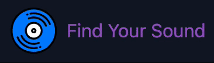
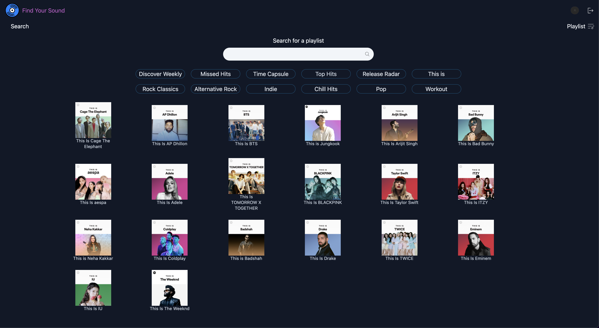
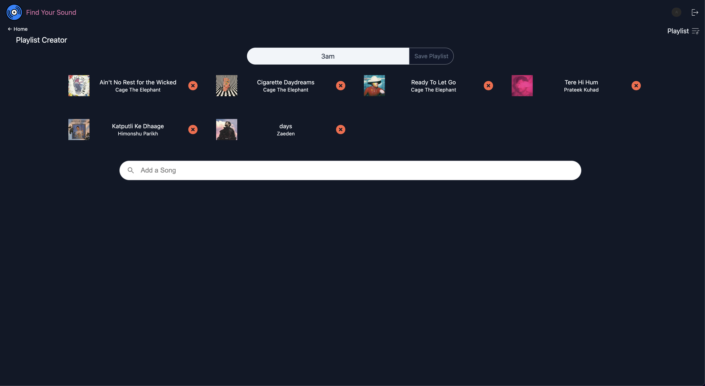
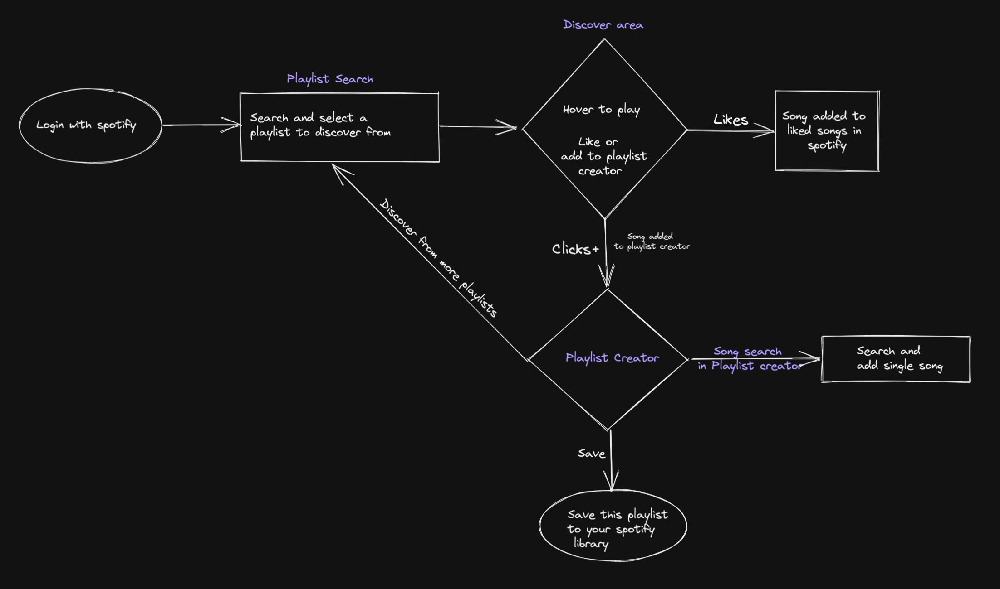
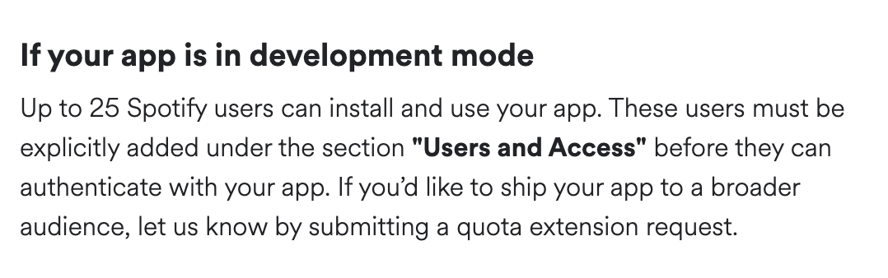

<h1 align="center">
  
</h1>
<h3 text="center">Simplify how you discover music and it to your library. Made for Spotify.</h3>

## [Click here to watch a Demo Video](https://player.vimeo.com/video/667388858?h=1055c2e218&badge=0&autopause=0&player_id=0&app_id=58479)

### Tools used

- React
- TailwindCSS
- Nodejs (for Auth Server) 

### How to run Locally

- Fork and Clone this repository
- Go to [Spotify Developer Dashboard](/developer.spotify.com/dashboard/applications) and create an application
- Generate ClientID and Client Secret (Do not share your secret with anyone)
- Update ENV for Server (checkout .env.sample) and src/constants in Client with your information
- Install dependencies for server and client , using ` npm install`
- Cd into server and run ` node server.js`
- Cd into client and run ` npm run start`

### Why is this not hosted?

Because spotify only allows pre defined spotify users to use an app in Development Phase . And your project need to have a defined use (not a hobby project) to be granted extended access.

